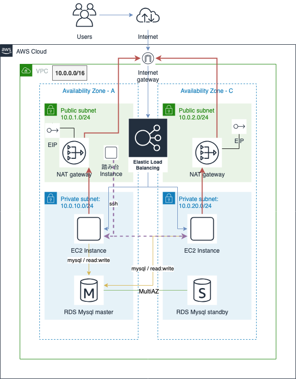

# 構成要素

リージョンは東京とする。

元: https://www.draw.io/#G16pGmRiOZcoDEV5ZVTtuVhLxdnsDWoQBX

## 構築手順
---

[手順メモへのリンクはここ](./procedure.md)

* VPCを作成する

  リソースが多いのでcloudformationで初期作成する。
  [VPC Cloudformation](./vpc.yml) をマネージメントコンソールから実行

* セキュリティグループを作成する

| name | 用途 |inbound roule|
|----|----|----|
| sg-web | webサーバーに対するセキュリティを設定する | - sg-gateからのssh許可.   - sg-elbからのhttp接続(80ポート)を許可|
| sg-db | RDSに対するセキュリティを設定する | - sg-webからの3306ポート許可|
| sg-gate | 踏み台サーバーに対するセキュリティを設定する | - ローカルからのssh接続を許可|
| sg-elb | ELBに対するセキュリティを設定する | - publicからのhttp接続を許可|

* RDSを作成する
mysql5.6

| name | subnet | MultiAZ|
|----|----|----|
| sample| sample-private-subnet-a   sample-private-subnet-c | yes |

  * パラメーターグループとオプショングループをデフォルトからコピーし、作成したDBに紐付ける

    デフォルトのものは編集できないため

  * サブネットグループ

    private subnetのみにする

* EC2,ELBを作成する

  * 踏み台サーバーとwebサーバー

| name | subnet | SG |
|----|----|----|
| sample-gate| sample-public-subnet-a |sg_gate |
| sample-web1| sample-private-subnet-a |sg-web |
| sample-web2| sample-private-subnet-c |sg-web |

| name | subnet | SG | ポート|
|----|----|----|----|
| sample-elb| sample-public-subnet-a   sample-public-subnet-c |sg_elb | 80:80|

  * ヘルスチェック

    TCP:80

* 確認手順を実施する

  手順メモ 10. 確認等 を参照

### VPC
---
AWSの仮想ネットワーク。
他の仮想ネットワークから切り離されているためセキュリティ性は高い。

* Availability Zone(AZ)

  リージョン内で物理的に隔離されたデータセンターと思ってよい。
  ap-northeast-1a , ap-northeast-1c を使用する

#### internet gateway
VPCを外部のインターネットと接続するために必要なもの

#### subnet
VPCをさらに分割した空間。
今回は以下のsubnetをAZごとに作る

* Public subnet
  インターネットからアクセスできる空間
* Private subnet
  インターネットからアクセスできない空間

#### nat gateway
Private subnetのインスタンスからインターネット接続するために使う
ミドルウェアなどを外部のレポジトリから取得する必要があるため

#### EIP
インターネットからアクセス可能なパブリックIPアドレス。
nat gatewayと踏み台インスタンスに割り当てる。

### EC2
---
仮想サーバーを構築できるサービス。
OSが入った環境を素早く作成することができる

今回は以下の3台の仮想サーバーを作成する

#### EC2インスタンス

* 踏み台サーバー用インスタンス * 1台
* Webサーバー用インスタンス * 2台

#### ELB
ロードバランサー。
インターネットからのトラフィックをWebサーバーに分散するために作成

### RDS
---

クラウド上でリレーショナルデータベースを簡単に使用することができる。

今回はMysqlを使用。
可用性を高めるため、マルチAZで配置し、
障害時でも自動的にフェイルオーバーするようにする。
