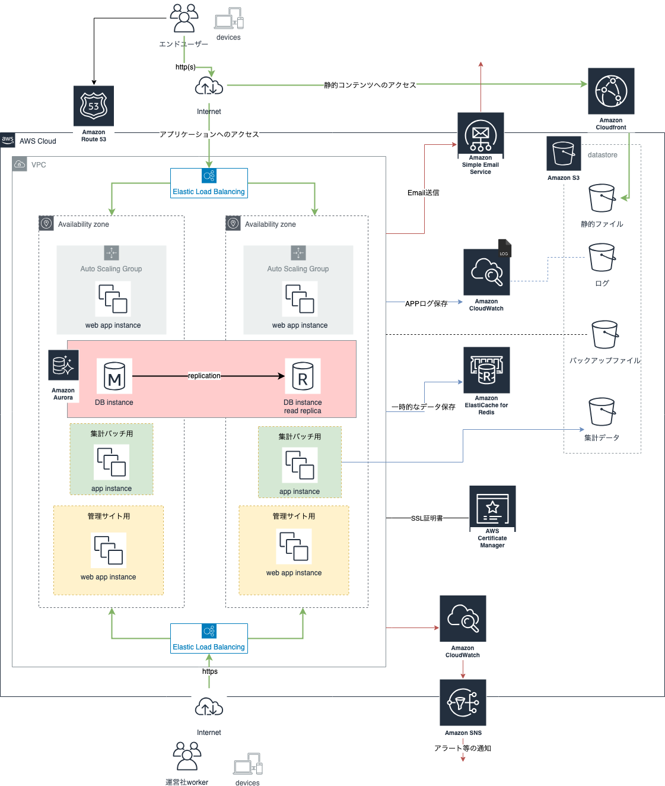

# 構成要素

リージョンは東京とする。

元: https://www.draw.io/#G16pGmRiOZcoDEV5ZVTtuVhLxdnsDWoQBX

## 提案内容

TV取材があるということ、取材後にビジネスを一気に広げたいということなので、
容易にスケーリング可能で、可用性にとんだ構成にしました。

アベイラビリティーゾーンをまたがり物理的に離れた場所にリソースを配置、
ロードバランサーによる負荷分散、
コンピューティングリソースの増減、データベースの自動フェイルオーバーなどを
可能にしたインフラ構成にすることにより、障害発生時にもカスタマー体験を
あまり損なうこと無い環境を目指せます。

また、CDNによる静的ファイルの高速配信を行うことにより
カスタマーにとって優れたパフォーマンスを提供することができます。

## 選択サービス

| name | サービス |
|----|----|
| DNS | Amazon Route53 |
| SSL証明書 | AWS Certificate Manager |
| コンテンツ配信 | Amazon Cloudfront |
| web,app,集計バッチサーバー | Amazon EC2 |
| 負荷分散 | Elastic Load Balancing |
| コンピューティング増減 | Amazon EC2 Auto Scaling |
| mail送信 | Amazon Simple Email Service |
| RDB | Amazon Aurora |
| Cache | Amazon ElastiCache |
| ストレージ | Amazon S3 |
| Log保存 | Amazon CloudWatch Logs |
| モニタリング | Amazon CloudWatch |

## ネットワーク構成案
基本方針として、各アベイラビリティーゾーンに
* pulic subnet(インターネットからアクセス可能)
* private subnet(インターネットからアクセス不可)
を作成する。

運営会社のネットワークとVPN接続,または専用線を引くことで
private subnetへのアクセスを可能にする。
ssh接続やインターネットに公開しなくていいサイトへのアクセスなどに使う。

VPN接続,または専用線を引かない場合、
pulic subnetに踏み台サーバーをたて、そこからprivate subnetの
インスタンス等にアクセスできるようにすることもできる

以下、メモ
### web,app,集計バッチサーバー

新サイトオープンまで1ヶ月ということだったので、既存のサーバーをそのまま持っていく想定。
負荷分散はElastic Load Balancingを使う。

### コンピューティング増減

TV取材の放送日があらかじめわかっている想定で、
放送時間の数時間前にインスタンス数を簡単に増やせるように
Auto Scaling Groupを作る。

### RDB
既存でMySQLを使用していると想定。
アプリケーションに変更を加えることなく使用でき、MySQLの最大5倍のパフォーマンスを出せるAuroraにする。
キーワード検索など、大量の読み込みが発生する可能性に備え、読み込みレプリカを各アベイラビリティーゾーンに作っておく。
プライマリの障害が起こっても、自動的にレプリカから昇格される。

データ移行に関しては、AWS Database Migration Serviceを使用するか、
ダンプファイルをインポートするか。

### Cache
参照するための商品情報、カートの中身、ログイン状態などをキャッシュすることにより、
データベースへの読み込みを減らしてパフォーマンスを上げることが目的で使用する

### Log保存,モニタリング
CloudWatch Logsにログファイルを送ることにより、保存、監視などの用途に使用する。
保存したログはS3にエクスポートし、集計でも使用できるようにするのが良い。

CloudWatchを使用して、
リソース使用率、アプリケーションパフォーマンスを把握することにより、より良い改善を可能にする
状態を目指す。

### ストレージ
アプリケーションのログ、バックアップ、集計サーバーで作成したデータなど、
消えてはまずいものを可用性が高いS3に保存する。

サイトで表示させる商品画像、css、jsファイルもS3に保存し、cloudfront経由で配信することにより
可用性に飛んだ高速配信を可能にする。
